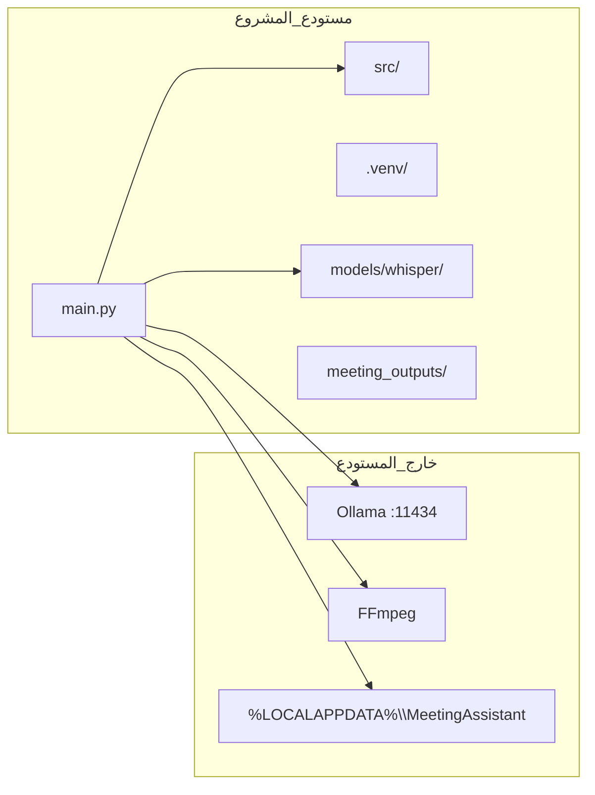
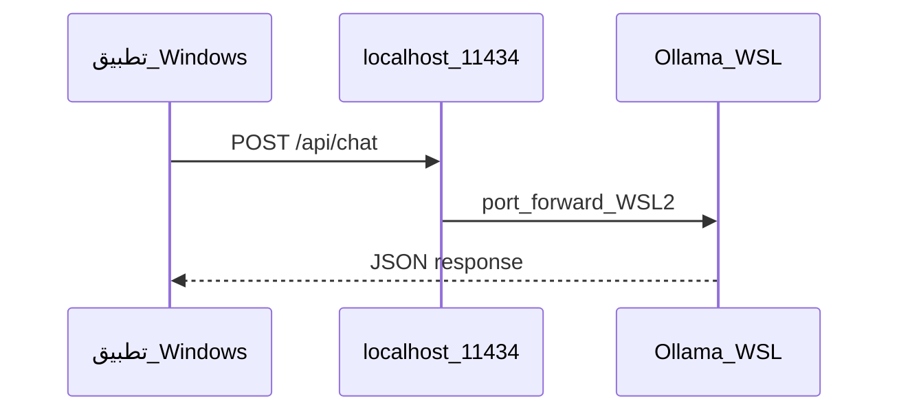

# دليل التثبيت ونقل المشروع إلى حاسوب آخر

دليل عربي مفصّل خطوة بخطوة لتثبيت **مساعد الاجتماعات المحلي** (Local AI Meeting Assistant) على Windows، أو نقله من حاسوب قديم إلى حاسوب جديد مع الحفاظ على البيانات والنماذج قدر الإمكان.

---

## جدول المحتويات

1. [المقدمة](#المقدمة)
2. [توضيح مهم: أين تُخزَّن الإعدادات؟](#توضيح-مهم-أين-تُخزَّن-الإعدادات)
3. [ما هي مجلدات المشروع الفعلية؟](#ما-هي-مجلدات-المشروع-الفعلية)
4. [المتطلبات قبل البدء](#المتطلبات-قبل-البدء)
5. [السيناريو أ: تثبيت جديد من الصفر على Windows](#السيناريو-أ-تثبيت-جديد-من-الصفر-على-windows)
6. [السيناريو ب: نقل المشروع من حاسوب إلى آخر](#السيناريو-ب-نقل-المشروع-من-حاسوب-إلى-آخر)
7. [نموذج Whisper: المسار، التنزيل، والنقل](#نموذج-whisper-المسار-والتنزيل-والنقل)
8. [توكن Hugging Face (مطلوب للنسخ الحقيقي)](#توكن-hugging-face-مطلوب-للنسخ-الحقيقي)
9. [Ollama على Windows](#ollama-على-windows)
10. [ملحق: Ollama داخل WSL بينما التطبيق على Windows](#ملحق-ollama-داخل-wsl-بينما-التطبيق-على-windows)
11. [ملف البيئة `.env`](#ملف-البيئة-env)
12. [تشغيل التطبيق](#تشغيل-التطبيق)
13. [قائمة التحقق النهائية قبل أول استخدام](#قائمة-التحقق-النهائية-قبل-أول-استخدام)
14. [استكشاف الأخطاء الشائعة](#استكشاف-الأخطاء-الشائعة)
15. [التسليم بدون إنترنت عبر USB (Path A)](#التسليم-بدون-إنترنت-عبر-usb-path-a)
16. [مراجع إضافية](#مراجع-إضافية)

---

<a id="المقدمة"></a>

## المقدمة

هذا المشروع تطبيق **سطح مكتب** يعمل محلياً على جهازك. يقوم بالآتي:

- **تفريغ الصوت إلى نص** باستخدام **WhisperX** (تعرف على الكلام، محاذاة زمنية، وتمييز المتحدثين).
- **تلخيص النص** باستخدام نموذج لغوي محلي عبر **Ollama**.
- واجهة مستخدم **Qt Quick (QML)** مع **PySide6**.

بشكل افتراضي، **لا يُرسل الصوت أو النص إلى السحابة** أثناء المعالجة؛ كل شيء يعمل على جهازك ما لم تُعدِّل الإعدادات.

### مخطط عام لعلاقة المكونات



---

<a id="توضيح-مهم-أين-تُخزَّن-الإعدادات"></a>

## توضيح مهم: أين تُخزَّن الإعدادات؟

**المشروع لا يستخدم مجلداً باسم `.config`.** إذا سمعت عن «مسار الإعداد» أو «مسار النموذج من الإعدادات»، فالمقصود هو ما يلي:

| المصدر | الموقع | ماذا يحتوي؟ |
|--------|--------|-------------|
| ملف البيئة | `.env` في **جذر المشروع** (نفس مجلد `main.py`) | متغيرات مثل Ollama ومسار Whisper وتوكن Hugging Face |
| قالب البيئة | `.env.example` | نموذج جاهز للنسخ؛ **لا يحتوي أسراراً** |
| كود الإعداد | `src/meeting_assistant/config.py` | القيم الافتراضية وقراءة المتغيرات |
| بيانات التطبيق | `%LOCALAPPDATA%\MeetingAssistant\` على Windows | قاعدة بيانات `meetings.db` (الجلسات والإعدادات المحفوظة من الواجهة) |
| ذاكرة نموذج Whisper | `{جذر_المشروع}/models/whisper/` | أوزان faster-whisper (CT2) — حوالي 2.6 غيغابايت لنموذج `large-v3` |
| جذر مخرجات الاجتماعات (اختياري) | متغير `MEETING_ASSISTANT_OUTPUT_ROOT` في `.env` | يُقرأ في `src/meeting_assistant/services/output_paths.py`؛ إن لم يُضبط، الافتراضي `{جذر_المشروع}/meeting_outputs/` مع مجلدات فرعية `sessions/{اسم_الجلسة}/` |

**المسار الافتراضي لنموذج Whisper** (من `config.py`):

```
{جذر_المشروع}/models/whisper
```

مثال إذا كان المشروع على القرص `Z:`:

```
Z:\Abo Farok\meeting_summary\models\whisper
```

يمكن تغيير هذا المسار عبر المتغير `MEETING_ASSISTANT_WHISPER_CACHE` في ملف `.env`.

---

<a id="ما-هي-مجلدات-المشروع-الفعلية"></a>

## ما هي مجلدات المشروع الفعلية؟

### جدول سريع: ماذا أنقل؟ وماذا أُعيد إنشاءه؟

| الفئة | المسار | الوصف | هل أنقله؟ |
|--------|--------|--------|-----------|
| **كود المصدر** | `src/` | التطبيق بالكامل (واجهة، خدمات، محولات) | **نعم** |
| **الاختبارات** | `tests/` | اختبارات pytest | **نعم** (إن كنت مطوراً) |
| **الوثائق** | `docs/` | مواصفات ودلائل | **نعم** |
| **سكربتات مساعدة** | `scripts/` | أدوات تدقيق وصيانة | **نعم** |
| **نقطة التشغيل** | `main.py` | ملف تشغيل التطبيق | **نعم** |
| **مشغّلات Windows** | `run.bat`, `run.ps1` | تشغيل سريع بعد تفعيل `.venv` | **نعم** |
| **التبعيات** | `requirements.txt`, `pyproject.toml` | قوائم الحزم وإعدادات المشروع | **نعم** |
| **قالب الإعداد** | `.env.example` | نموذج لملف `.env` | **نعم** |
| **ملف الأسرار** | `.env` | توكنات وإعدادات شخصية | **نعم** (بحذر — لا تشاركه) |
| **الترخيص** | `LICENSE` | Apache 2.0 | **نعم** |
| **بيئة Python** | `.venv/` | الحزم المثبتة محلياً | **لا** — أعد إنشاءها على الجهاز الجديد |
| **مخلفات Python** | `__pycache__/`, `*.pyc` | ملفات مؤقتة | **لا** — تُنشأ تلقائياً |
| **مخرجات الاجتماعات** | `meeting_outputs/sessions/` | صوت، نصوص، ملخصات لكل جلسة تحت مجلد فرعي باسم الجلسة | **اختياري** — انقله إن أردت الاحتفاظ بالملفات |
| **نموذج Whisper** | `models/whisper/` | أوزان CT2 كبيرة الحجم | **اختياري** — انقله لتوفير إعادة التنزيل |
| **قاعدة البيانات** | `%LOCALAPPDATA%\MeetingAssistant\meetings.db` | جلسات وإعدادات الواجهة | **اختياري** — انقله للاحتفاظ بالتاريخ |
| **ذاكرة اختبار** | `.pytest_cache/`, `htmlcov/` | نتائج اختبارات محلية | **لا** |
| **ذاكرة أدوات** | `.ruff_cache/`, `.mypy_cache/` | ذاكرة مؤقتة للأدوات | **لا** |

### شجرة المستودع (الهيكل الأساسي)

```
meeting_summary/                 ← جذر المشروع (يجب أن يحتوي main.py)
├── main.py                      ← تشغيل التطبيق من هنا
├── run.bat                      ← مشغّل CMD
├── run.ps1                      ← مشغّل PowerShell
├── requirements.txt             ← حزم Python الأساسية
├── pyproject.toml               ← إعدادات المشروع وأدوات التطوير
├── .env.example                 ← قالب الإعدادات
├── .env                         ← إعداداتك (لا ترفعه إلى git)
├── .venv/                       ← بيئة افتراضية (لا تنقلها)
├── models/
│   └── whisper/                 ← نموذج Whisper (يُنشأ عند التنزيل)
├── meeting_outputs/             ← مخرجات الاجتماعات (يُنشأ عند الاستخدام)
│   └── sessions/                ← مجلد فرعي لكل جلسة (صوت، تفريغ، ملخص)
├── src/
│   └── meeting_assistant/       ← كود التطبيق
│       ├── adapters/            ← SQLite, WhisperX, Ollama
│       ├── core/                ← نماذج وثوابت
│       ├── ports/               ← واجهات برمجية
│       ├── services/            ← محرك WhisperX, FFmpeg, مسارات الملفات
│       ├── workers/             ← خيوط الخلفية
│       ├── ui/                  ← متحكمات الواجهة
│       ├── qml/                 ← ملفات الواجهة المرئية
│       └── i18n/                ← ترجمة عربية
├── tests/                       ← اختبارات
├── docs/                        ← وثائق (بما فيها هذا الدليل)
└── scripts/                     ← سكربتات مساعدة
```

### بيانات خارج مجلد المشروع (Windows)

على Windows، يخزّن التطبيق بياناته الافتراضية هنا:

```
C:\Users\<اسم_المستخدم>\AppData\Local\MeetingAssistant\
└── meetings.db
```

يمكن فتح المسار بسرعة من PowerShell:

```powershell
explorer "$env:LOCALAPPDATA\MeetingAssistant"
```

---

<a id="المتطلبات-قبل-البدء"></a>

## المتطلبات قبل البدء

قبل البدء، تأكد من توفر ما يلي:

| المتطلب | التفاصيل |
|---------|----------|
| **نظام التشغيل** | Windows 10 أو أحدث (هذا الدليل يركّز على Windows) |
| **Python** | الإصدار **3.11** أو **3.12** (مطلوب في `pyproject.toml`) |
| **مساحة القرص** | على الأقل **5 غيغابايت** فارغة (3+ للنموذج، والباقي للحزم والمخرجات) |
| **الإنترنت** | مطلوب للتنزيل الأولي للحزم والنموذج (ما لم تنقل `models/whisper/` جاهزاً) |
| **Ollama** | خادم نماذج لغوية محلية — يُثبَّت على الجهاز |
| **FFmpeg** | مطلوب لفك ترميز الصوت ومعالجته قبل WhisperX |
| **(اختياري) GPU NVIDIA** | يسرّع WhisperX؛ يتطلب PyTorch بدعم CUDA |

---

<a id="السيناريو-أ-تثبيت-جديد-من-الصفر-على-windows"></a>

## السيناريو أ: تثبيت جديد من الصفر على Windows

اتبع الخطوات بالترتيب. كل خطوة تفترض أنك أكملت ما قبلها.

### الخطوة 1: تثبيت Python

1. نزّل Python من [python.org](https://www.python.org/downloads/) (الإصدار 3.11 أو 3.12).
2. أثناء التثبيت، فعّل الخيار **«Add python.exe to PATH»**.
3. افتح **PowerShell** جديداً وتحقق:

```powershell
python --version
```

يجب أن يظهر شيء مثل: `Python 3.12.x`

إذا ظهر خطأ «الأمر غير معروف»، أعد تشغيل PowerShell أو أعد تثبيت Python مع تفعيل PATH.

---

### الخطوة 2: الحصول على مجلد المشروع

**الطريقة أ — من git (إن كان المستودع على GitHub):**

```powershell
git clone <رابط_المستودع>
cd meeting_summary
```

**الطريقة ب — نسخ مجلد:**

انسخ مجلد المشروع بالكامل إلى موقع ثابت، مثلاً:

```
D:\Projects\meeting_summary
```

**المهم:** يجب أن ترى ملف `main.py` داخل المجلد الحالي.

```powershell
cd "D:\Projects\meeting_summary"
dir main.py
```

---

### الخطوة 3: إنشاء البيئة الافتراضية (venv)

البيئة الافتراضية تعزل حزم هذا المشروع عن باقي برامج Python على جهازك.

من **جذر المشروع** (مجلد `main.py`):

```powershell
python -m venv .venv
```

انتظر حتى ينتهي الإنشاء. سيظهر مجلد جديد اسمه `.venv`.

---

### الخطوة 4: تفعيل البيئة الافتراضية

في **PowerShell**:

```powershell
.venv\Scripts\Activate.ps1
```

عند النجاح، يظهر `(.venv)` في بداية سطر الأوامر.

**إذا ظهر خطأ يتعلق بسياسة التنفيذ (Execution Policy):**

```powershell
Set-ExecutionPolicy -ExecutionPolicy RemoteSigned -Scope CurrentUser
```

ثم أعد محاولة التفعيل:

```powershell
.venv\Scripts\Activate.ps1
```

**بديل — موجه الأوامر CMD:**

```cmd
.venv\Scripts\activate.bat
```

> **ملاحظة:** في كل جلسة PowerShell جديدة، يجب تفعيل `.venv` مرة أخرى قبل تشغيل التطبيق أو تثبيت الحزم.

---

### الخطوة 5: ترقية pip

```powershell
python -m pip install --upgrade pip
```

---

### الخطوة 6: تثبيت حزم Python الأساسية

هذا هو التثبيت **الإلزامي** لجميع المستخدمين:

```powershell
pip install -r requirements.txt
```

قد يستغرق عدة دقائق حسب سرعة الإنترنت. الحزم الرئيسية:

| الحزمة | الدور |
|--------|------|
| `PySide6` | واجهة سطح المكتب |
| `whisperx` | تفريغ الصوت وتمييز المتحدثين |
| `torch` | محرك التعلم العميق لـ WhisperX |
| `huggingface_hub` | تنزيل نموذج Whisper |
| `httpx` | الاتصال بـ Ollama |
| `python-dotenv` | قراءة ملف `.env` |
| `nvidia-*` | مكتبات CUDA على Windows (للـ GPU) |

---

### الخطوة 7: تثبيت المشروع كحزمة (اختياري)

#### للمستخدم العادي

**لا تحتاج** هذا الخطوة لتشغيل التطبيق. يكفي `pip install -r requirements.txt` ثم `python main.py`.

#### للمطورين

تثبيت المشروع بوضع «قابل للتعديل» (editable):

```powershell
pip install -e .
```

**تنبيه مهم:** ملف `pyproject.toml` يحتوي `dependencies = []` — أي أن `pip install -e .` **لا يثبت** حزم `requirements.txt`. يجب دائماً تشغيل `pip install -r requirements.txt` أولاً.

لأدوات التطوير (Ruff للفحص):

```powershell
pip install -e ".[dev]"
ruff check src tests
```

لتشغيل الاختبارات:

```powershell
pip install pytest
$env:PYTHONPATH = "src"
pytest
```

---

### الخطوة 8: PyTorch مع دعم CUDA (اختياري — موصى به لمن لديه GPU NVIDIA)

حزمة `torch` من `pip install -r requirements.txt` غالباً **بدون CUDA** (معالجة على المعالج فقط).

لتفعيل GPU، أعد تثبيت PyTorch من موقع PyTorch الرسمي. **بعد تفعيل `.venv`**:

**مثال — CUDA 12.4:**

```powershell
pip install torch torchvision torchaudio --index-url https://download.pytorch.org/whl/cu124
```

**مثال — CUDA 12.8:**

```powershell
pip install torch torchvision torchaudio --index-url https://download.pytorch.org/whl/cu128
```

**التحقق من نجاح CUDA:**

```powershell
python -c "import torch; print('cuda:', torch.cuda.is_available(), 'version:', torch.version.cuda)"
```

إذا طبع `cuda: True` فالـ GPU جاهز. إذا طبع `False`، سيستخدم التطبيق المعالج (أبطأ لكنه يعمل).

---

### الخطوة 9: تثبيت FFmpeg

FFmpeg مطلوب لتحويل وفك ملفات الصوت قبل إرسالها إلى WhisperX.

**الطريقة السهلة (winget):**

```powershell
winget install ffmpeg
```

أغلق PowerShell وافتحه من جديد، ثم تحقق:

```powershell
ffmpeg -version
```

**إذا لم يُعثر على FFmpeg:**

1. نزّله من [ffmpeg.org](https://ffmpeg.org/download.html).
2. ضع المسار الكامل في `.env`:

```
MEETING_ASSISTANT_FFMPEG_PATH=C:\path\to\ffmpeg.exe
```

---

### الخطوة 10: إنشاء ملف `.env`

من جذر المشروع:

```powershell
copy .env.example .env
```

افتح `.env` بمحرر نصوص وعدّل القيم حسب حاجتك (انظر [قسم ملف البيئة](#ملف-البيئة-env)).

**لا ترفع ملف `.env` إلى git أو تشاركه مع أحد** — قد يحتوي توكن Hugging Face.

---

### الخطوة 11: تثبيت Ollama وسحب النموذج

راجع [قسم Ollama على Windows](#ollama-على-windows) بالتفصيل.

باختصار:

1. ثبّت Ollama من [ollama.com](https://ollama.com/).
2. اسحب النموذج الافتراضي:

```powershell
ollama pull gemma4:e4b128k
```

---

### الخطوة 12: إعداد توكن Hugging Face

راجع [قسم توكن Hugging Face](#توكن-hugging-face-مطلوب-للنسخ-الحقيقي).

---

### الخطوة 13: تنزيل نموذج Whisper

راجع [قسم نموذج Whisper](#نموذج-whisper-المسار-والتنزيل-والنقل).

---

### الخطوة 14: تشغيل التطبيق

```powershell
python main.py
```

أو:

```powershell
.\run.ps1
```

---

<a id="السيناريو-ب-نقل-المشروع-من-حاسوب-إلى-آخر"></a>

## السيناريو ب: نقل المشروع من حاسوب إلى آخر

هذا القسم للمستخدم الذي **لديه المشروع يعمل على جهاز قديم** ويريد نقله إلى جهاز جديد مع الاحتفاظ بالجلسات والنماذج إن أمكن.

### المرحلة 1: على الحاسوب القديم — ماذا أنسخ؟

استخدم قائمة التحقق التالية:

- [ ] **مجلد المشروع بالكامل** باستثناء `.venv/`
- [ ] **(اختياري)** مجلد `models/whisper/` — لتجنب إعادة تنزيل ~2.6 غيغابايت
- [ ] **(اختياري)** مجلد `meeting_outputs/` — ملفات الصوت والنصوص والملخصات
- [ ] **(اختياري)** ملف `.env` — إعداداتك وتوكناتك
- [ ] **(اختياري)** ملف `meetings.db` من:
  ```
  %LOCALAPPDATA%\MeetingAssistant\meetings.db
  ```

#### ما لا تنسخه أبداً

| العنصر | السبب |
|--------|--------|
| `.venv/` | مرتبط بنظام Python والمسارات على الجهاز القديم — **أعد إنشاءه دائماً** |
| `__pycache__/` | مخلفات — تُنشأ تلقائياً |
| `.pytest_cache/` | ذاكرة اختبارات محلية |

#### طريقة النسخ المقترحة

**عبر قرص خارجي أو شبكة:**

1. انسخ مجلد المشروع إلى القرص الخارجي **بدون** `.venv`.
2. إن كان `models/whisper/` كبيراً وتريد توفير الوقت، تأكد أن النسخ اكتمل (لا ملفات `.incomplete`).
3. انسخ `meetings.db` إن أردت الاحتفاظ بالجلسات.

**تقدير الحجم:**

| العنصر | الحجم التقريبي |
|--------|----------------|
| كود المشروع (بدون نموذج) | عشرات الميغابايت |
| `models/whisper/` (large-v3) | ~2.6 غيغابايت |
| `meeting_outputs/` | يعتمد على عدد الاجتماعات |
| `meetings.db` | عادة صغير (كيلوبايت إلى ميغابايت) |

---

### المرحلة 2: على الحاسوب الجديد — الإعداد

1. **ثبّت Python 3.11+** (انظر [الخطوة 1](#الخطوة-1-تثبيت-python)).
2. **ضع مجلد المشروع** في موقع دائم، مثلاً `D:\Projects\meeting_summary`.
3. **أنشئ بيئة افتراضية جديدة** — لا تنسخ `.venv` القديم:

```powershell
cd "D:\Projects\meeting_summary"
python -m venv .venv
.venv\Scripts\Activate.ps1
python -m pip install --upgrade pip
pip install -r requirements.txt
```

4. **(اختياري)** ثبّت PyTorch مع CUDA إن كان لديك GPU ([الخطوة 8](#الخطوة-8-pytorch-مع-دعم-cuda-اختياري--موصى-به-لمن-لديه-gpu-nvidia)).
5. **ثبّت FFmpeg و Ollama** على الجهاز الجديد.
6. **انقل `models/whisper/`** إن نسخته — ضعه في:

```
D:\Projects\meeting_summary\models\whisper\
```

7. **انقل `meetings.db`** إن أردت الاحتفاظ بالجلسات:

```powershell
# أنشئ المجلد إن لم يكن موجوداً
New-Item -ItemType Directory -Force -Path "$env:LOCALAPPDATA\MeetingAssistant"

# انسخ الملف (عدّل مسار المصدر)
Copy-Item "E:\Backup\meetings.db" "$env:LOCALAPPDATA\MeetingAssistant\meetings.db"
```

**بديل:** عيّن مساراً مخصصاً في `.env`:

```
MEETING_ASSISTANT_DB=D:\Backup\meetings.db
```

8. **انقل `meeting_outputs/`** إلى جذر المشروع إن أردت الاحتفاظ بملفات الاجتماعات القديمة.
9. **انسخ أو أنشئ `.env`** — إن لم تنقل `.env`، انسخ من القالب:

```powershell
copy .env.example .env
```

10. **تحقق من قائمة التحقق النهائية** ثم شغّل:

```powershell
python main.py
```

### ملاحظات مهمة عند النقل

| الحالة | ماذا تفعل؟ |
|--------|------------|
| تغيّر مسار مجلد المشروع | لا حاجة لتعديل `PROJECT_ROOT` — يُحسب تلقائياً من موقع الكود |
| نقلت `models/whisper/` كاملاً | افتح التطبيق → الإعدادات → تحقق أن حالة النموذج «مكتمل» |
| لم تنقل النموذج | استخدم التنزيل من الواجهة أو الطرق في [قسم Whisper](#نموذج-whisper-المسار-والتنزيل-والنقل) |
| نماذج Ollama | يجب سحبها من جديد على الجهاز الجديد: `ollama pull ...` — لا تُخزَّن داخل مجلد المشروع |
| توكن HF في `.env` أو `meetings.db` | ينتقل مع الملف الذي نسخته |

---

<a id="نموذج-whisper-المسار-والتنزيل-والنقل"></a>

## نموذج Whisper: المسار، التنزيل، والنقل

التطبيق يستخدم **faster-whisper** بصيغة **CTranslate2 (CT2)**. النموذج الافتراضي: **`large-v3`** من مستودع Hugging Face `Systran/faster-whisper-large-v3`.

### أين يُخزَّن النموذج؟

| الإعداد | القيمة الافتراضية |
|---------|-------------------|
| متغير البيئة | `MEETING_ASSISTANT_WHISPER_CACHE` |
| المسار الافتراضي | `{جذر_المشروع}/models/whisper` |
| حجم `model.bin` لـ `large-v3` | على الأقل **2,600,000,000** بايت (~2.6 غيغابايت) |

لتغيير المسار (مثلاً قرص آخر):

```
MEETING_ASSISTANT_WHISPER_CACHE=D:\AI_Models\whisper
```

### الطريقة 1: التنزيل من داخل التطبيق (الأسهل — موصى بها)

1. شغّل التطبيق (`python main.py`).
2. افتح **الإعدادات** (Settings).
3. اذهب إلى قسم **نموذج الكلام** (Speech model).
4. اضغط **تنزيل / استئناف** (Download / resume).
5. انتظر حتى يكتمل الشريط — قد يستغرق وقتاً طويلاً حسب سرعة الإنترنت.
6. يعرض التطبيق **مسار الذاكرة المؤقتة** (cache path) — يجب أن يطابق `models/whisper` أو المسار في `.env`.

> التنزيل من الواجهة **لا يحتاج** توكن Hugging Face (مستودعات Systran عامة). التوكن مطلوب لاحقاً عند **التفريغ الفعلي** (بسبب pyannote للتمييز بين المتحدثين).

---

### الطريقة 2: نقل المجلد من الحاسوب القديم

إذا كان النموذج مكتملاً على الجهاز القديم:

1. على الجهاز القديم، انسخ المجلد بالكامل:

```
{جذر_المشروع_القديم}\models\whisper\
```

2. على الجهاز الجديد، الصقه في:

```
{جذر_المشروع_الجديد}\models\whisper\
```

3. تحقق من وجود الملفات التالية داخل مجلد اللقطة (snapshot) — عادة تحت مسار يشبه:

```
models\whisper\models--Systran--faster-whisper-large-v3\snapshots\<معرّف>\ 
```

**الملفات المطلوبة:**

| الملف | مطلوب؟ |
|-------|--------|
| `model.bin` | نعم — الأكبر حجماً |
| `config.json` | نعم |
| `tokenizer.json` | نعم |
| `preprocessor_config.json` | نعم |
| `vocabulary.*` | نعم (ملف واحد على الأقل) |
| أي ملف ينتهي بـ `.incomplete` | **يجب عدم وجوده** — يدل على تنزيل غير مكتمل |

**التحقق السريع من حجم model.bin في PowerShell:**

```powershell
Get-ChildItem -Recurse ".\models\whisper" -Filter "model.bin" | Select-Object FullName, Length
```

يجب أن يكون `Length` لـ `large-v3` أكبر من 2,600,000,000.

---

### الطريقة 3: التنزيل اليدوي عبر سطر الأوامر (متقدم)

من جذر المشروع، **بعد تفعيل `.venv`**:

```powershell
python -c "
from pathlib import Path
from huggingface_hub import snapshot_download

cache = Path('models/whisper')
cache.mkdir(parents=True, exist_ok=True)
path = snapshot_download(
    repo_id='Systran/faster-whisper-large-v3',
    cache_dir=str(cache),
    allow_patterns=[
        'config.json',
        'preprocessor_config.json',
        'model.bin',
        'tokenizer.json',
        'vocabulary.*',
    ],
)
print('تم التنزيل إلى:', path)
"
```

لنموذج آخر، غيّر `repo_id` حسب الجدول في `src/meeting_assistant/config.py` (مفتاح `FASTER_WHISPER_HF_REPOS`).

**أمثلة نماذج أخرى:**

| المفتاح | مستودع Hugging Face |
|---------|---------------------|
| `large-v2` | `Systran/faster-whisper-large-v2` |
| `medium` | `Systran/faster-whisper-medium` |
| `turbo` | `mobiuslabsgmbh/faster-whisper-large-v3-turbo` |

لتغيير النموذج المستخدم، عيّن في `.env`:

```
MEETING_ASSISTANT_WHISPER_MODEL=large-v3
```

---

### مسح الذاكرة المؤقتة وإعادة التنزيل

إذا كان النموذج تالفاً أو ناقصاً:

1. أغلق التطبيق.
2. احذف محتويات `models/whisper/` (أو المسار في `MEETING_ASSISTANT_WHISPER_CACHE`).
3. أعد التنزيل من الواجهة أو بالطريقة اليدوية أعلاه.

---

<a id="توكن-hugging-face-مطلوب-للنسخ-الحقيقي"></a>

## توكن Hugging Face (مطلوب للنسخ الحقيقي)

التفريغ الحقيقي (وليس وضع المحاكاة) **يتطلب** توكن Hugging Face لأن خط أنابيب pyannote لتمييز المتحدثين محمي على المنصة.

### الخطوات

1. أنشئ حساباً على [huggingface.co](https://huggingface.co/) إن لم يكن لديك.
2. أنشئ **Access Token** من: Settings → Access Tokens (صلاحية **Read** كافية).
3. **اقبل شروط الاستخدام** لنماذج pyannote على صفحاتها في Hugging Face Hub (ابحث عن `pyannote` في مستودعات المشروع).
4. ضع التوكن بإحدى الطريقتين:

**أ) في ملف `.env` (جذر المشروع):**

```
MEETING_ASSISTANT_HF_TOKEN=hf_xxxxxxxxxxxxxxxxxxxx
```

**ب) من داخل التطبيق:** الإعدادات → لصق التوكن → حفظ.

> إذا كان التوكن محفوظاً في إعدادات التطبيق (SQLite) **وغير فارغ**، يتجاوز قيمة `.env`.

**أسماء متغيرات بديلة مقبولة:**

- `MEETING_ASSISTANT_HF_TOKEN`
- `HF_ACCESS_TOKEN`
- `HUGGING_FACE_HUB_TOKEN`
- `HF_TOKEN`

---

<a id="ollama-على-windows"></a>

## Ollama على Windows

Ollama خادم محلي يشغّل نماذج لغوية. التطبيق يتصل به عبر HTTP لطلب التلخيص.

### الخطوة 1: تثبيت Ollama

1. نزّل المثبت من [https://ollama.com](https://ollama.com).
2. ثبّت البرنامج واتبع المعالج.
3. بعد التثبيت، تعمل خدمة Ollama عادة في الخلفية (أيقونة في شريط المهام).

### الخطوة 2: التحقق من أن Ollama يعمل

افتح PowerShell:

```powershell
ollama list
```

إذا ظهرت قائمة (حتى لو فارغة) فالخدمة تعمل. إذا ظهر خطأ اتصال، أعد تشغيل Ollama من قائمة ابدأ.

### الخطوة 3: سحب النموذج المطلوب

النموذج الافتراضي في التطبيق: **`gemma4:e4b128k`**

```powershell
ollama pull gemma4:e4b128k
```

إذا استخدمت نموذجاً آخر، عيّنه في `.env`:

```
MEETING_ASSISTANT_OLLAMA_MODEL=اسم_النموذج
```

وتأكد من سحبه:

```powershell
ollama pull اسم_النموذج
```

### الخطوة 4: اختبار الاتصال من PowerShell

```powershell
curl http://localhost:11434/api/tags
```

يجب أن يعيد JSON يحتوي قائمة النماذج المثبتة.

### إعدادات Ollama في المشروع

| المتغير | الافتراضي على Windows | المعنى |
|---------|----------------------|--------|
| `MEETING_ASSISTANT_OLLAMA_HOST` | `localhost` | اسم المضيف |
| `MEETING_ASSISTANT_OLLAMA_PORT` | `11434` | المنفذ |
| `MEETING_ASSISTANT_OLLAMA_BASE_URL` | *(غير مضبوط)* | إن عُيّن، يتجاوز HOST و PORT بالكامل |
| `MEETING_ASSISTANT_OLLAMA_MODEL` | `gemma4:e4b128k` | اسم النموذج في طلبات التلخيص |

**العنوان الفعلي الافتراضي على Windows:**

```
http://localhost:11434
```

**مثال `.env`:**

```
MEETING_ASSISTANT_OLLAMA_MODEL=gemma4:e4b128k
MEETING_ASSISTANT_OLLAMA_HOST=localhost
MEETING_ASSISTANT_OLLAMA_PORT=11434
```

---

<a id="ملحق-ollama-داخل-wsl-بينما-التطبيق-على-windows"></a>

## ملحق: Ollama داخل WSL بينما التطبيق على Windows

سيناريو شائع: **التطبيق يعمل على Windows**، لكن **Ollama مثبت داخل WSL2** (Linux فرعي). الكود يضبط المضيف الافتراضي على Windows إلى `localhost` لأن WSL2 يعيد توجيه المنفذ 11434 تلقائياً في أغلب الحالات.



### إعداد Ollama داخل WSL

1. افتح **WSL** (Ubuntu أو توزيعتك):

```powershell
wsl
```

2. ثبّت Ollama داخل Linux (اتبع تعليمات ollama.com لـ Linux)، أو:

```bash
curl -fsSL https://ollama.com/install.sh | sh
```

3. شغّل الخدمة (إن لم تكن تعمل):

```bash
ollama serve
```

4. في نافذة WSL أخرى، اسحب النموذج:

```bash
ollama pull gemma4:e4b128k
```

5. تحقق:

```bash
curl http://127.0.0.1:11434/api/tags
```

### الاتصال من Windows

من **PowerShell على Windows** (خارج WSL):

```powershell
curl http://localhost:11434/api/tags
```

إذا نجح، التطبيق يجب أن يتصل دون تعديل.

### إذا لم يعمل الاتصال

| المشكلة | الحل المقترح |
|---------|--------------|
| `curl` من Windows يفشل | تأكد أن `ollama serve` يعمل داخل WSL |
| مهلة أو رفض اتصال | جرّب في `.env`: `MEETING_ASSISTANT_OLLAMA_BASE_URL=http://127.0.0.1:11434` |
| منفذ مختلف | عيّن `MEETING_ASSISTANT_OLLAMA_PORT` أو `BASE_URL` بالكامل |
| جدار ناري | اسمح بالاتصال المحلي على المنفذ 11434 |

### Ollama على Windows والتطبيق داخل WSL (أقل شيوعاً)

إذا شغّلت التطبيق **داخل WSL** وOllama على **Windows**:

- الافتراضي داخل Linux يكون `127.0.0.1:11434`.
- قد تحتاج `MEETING_ASSISTANT_OLLAMA_BASE_URL` يشير إلى عنوان Windows host — يختلف حسب إعداد WSL (أحياناً IP من `/etc/resolv.conf`).

هذا الدليل يركّز على **تطبيق Windows + Ollama في WSL**؛ للحالات العكسية راجع [README.md](../README.md) قسم Troubleshooting.

---

<a id="ملف-البيئة-env"></a>

## ملف البيئة `.env`

### الإنشاء

```powershell
copy .env.example .env
```

### قواعد التحميل

- يُقرأ من **جذر المشروع** (بجانب `main.py`).
- **متغيرات نظام التشغيل** لها أولوية على `.env` (`override=False`).
- **لا ترفع `.env` إلى git.**

### أهم المتغيرات للمستخدم الجديد

```ini
# --- Hugging Face (مطلوب للتفريغ الحقيقي) ---
MEETING_ASSISTANT_HF_TOKEN=hf_xxxxxxxx

# --- Ollama ---
MEETING_ASSISTANT_OLLAMA_MODEL=gemma4:e4b128k
# MEETING_ASSISTANT_OLLAMA_BASE_URL=http://localhost:11434

# --- مسار نموذج Whisper ---
# MEETING_ASSISTANT_WHISPER_CACHE=D:\Projects\meeting_summary\models\whisper
MEETING_ASSISTANT_WHISPER_MODEL=large-v3

# --- الجهاز: cuda أو cpu أو auto ---
MEETING_ASSISTANT_WHISPER_DEVICE=cuda

# --- FFmpeg (إن لم يكن على PATH) ---
# MEETING_ASSISTANT_FFMPEG_PATH=C:\ffmpeg\bin\ffmpeg.exe

# --- وضع المحاكاة (بدون AI حقيقي — للتجربة فقط) ---
# MEETING_ASSISTANT_MOCK=0
```

**قائمة كاملة:** راجع [README.md](../README.md) قسم «Configuration (environment variables)» أو `src/meeting_assistant/config.py`.

---

<a id="تشغيل-التطبيق"></a>

## تشغيل التطبيق

### من PowerShell (بعد تفعيل `.venv`)

```powershell
cd "D:\Projects\meeting_summary"
.venv\Scripts\Activate.ps1
python main.py
```

### باستخدام المشغّل الجاهز

```powershell
.\run.ps1
```

أو من CMD:

```cmd
run.bat
```

> `run.ps1` و `run.bat` يفعّلان `.venv` تلقائياً ثم يشغّلان `main.py`. إن لم يوجد `.venv`، يظهر رسالة تطلب إنشاءه.

### وضع المحاكاة (بدون Whisper ولا Ollama)

لتجربة الواجهة فقط:

```powershell
$env:MEETING_ASSISTANT_MOCK = "1"
python main.py
```

في هذا الوضع **لا حاجة** لـ FFmpeg أو Ollama أو توكن HF.

---

<a id="قائمة-التحقق-النهائية-قبل-أول-استخدام"></a>

## قائمة التحقق النهائية قبل أول استخدام

قبل معالجة أول اجتماع حقيقي، تأكد من:

- [ ] **Python 3.11+** مثبت و`.venv` مفعّل
- [ ] **`pip install -r requirements.txt`** نُفّذ بنجاح
- [ ] **Ollama** يعمل والنموذج مُسحوب (`ollama list` يعرض النموذج)
- [ ] **اختبار Ollama:** `curl http://localhost:11434/api/tags` يعيد JSON
- [ ] **توكن Hugging Face** مضبوط (في `.env` أو إعدادات التطبيق)
- [ ] **شروط pyannote** مقبولة على Hugging Face Hub
- [ ] **نموذج Whisper** مكتمل في `models/whisper/` (أو المسار في `MEETING_ASSISTANT_WHISPER_CACHE`)
- [ ] **FFmpeg** متاح (`ffmpeg -version`)
- [ ] **(اختياري)** CUDA يعمل: `python -c "import torch; print(torch.cuda.is_available())"` يطبع `True`
- [ ] ملف **`.env`** معدّ (أو الاعتماد على الإعدادات الافتراضية)

---

<a id="استكشاف-الأخطاء-الشائعة"></a>

## استكشاف الأخطاء الشائعة

### فشل تفعيل `.venv` في PowerShell

**العرض:** رسالة عن Execution Policy.

**الحل:**

```powershell
Set-ExecutionPolicy -ExecutionPolicy RemoteSigned -Scope CurrentUser
```

---

### التطبيق لا يتصل بـ Ollama

1. تحقق: `ollama list`
2. تحقق: `curl http://localhost:11434/api/tags`
3. راجع `.env`: `MEETING_ASSISTANT_OLLAMA_BASE_URL` أو HOST/PORT
4. إن كان Ollama في WSL، راجع [ملحق WSL](#ملحق-ollama-داخل-wsl-بينما-التطبيق-على-windows)

---

### خطأ في التفريغ: توكن Hugging Face

**العرض:** رفض التفريغ أو رسالة عن token.

**الحل:**

1. أنشئ توكناً على huggingface.co
2. اقبل شروط نماذج pyannote
3. ضع التوكن في `.env` أو إعدادات التطبيق

---

### نموذج Whisper غير مكتمل

**العرض:** التطبيق يطلب التنزيل أو يفشل عند التفريغ.

**الحل:**

1. الإعدادات → تنزيل النموذج
2. أو احذف `models/whisper/` وأعد التنزيل
3. تحقق من عدم وجود ملفات `.incomplete`
4. تحقق من حجم `model.bin` (≥ 2.6 GB لـ large-v3)

---

### FFmpeg غير موجود

**العرض:** فشل عند معالجة ملف صوت.

**الحل:**

```powershell
winget install ffmpeg
```

أو عيّن `MEETING_ASSISTANT_FFMPEG_PATH` في `.env`.

---

### أخطاء GPU أو CUDA

**العرض:** تعطل عند التفريغ أو تحذير عند البدء.

**الحلول:**

1. ثبّت PyTorch مع CUDA (انظر [الخطوة 8](#الخطوة-8-pytorch-مع-دعم-cuda-اختياري--موصى-به-لمن-لديه-gpu-nvidia))
2. مؤقتاً استخدم المعالج:

```
MEETING_ASSISTANT_WHISPER_DEVICE=cpu
```

3. قلّل الحمل:

```
MEETING_ASSISTANT_WHISPERX_BATCH_SIZE=4
```

---

### `pytest` لا يجد الحزم

**الحل:**

```powershell
$env:PYTHONPATH = "src"
pytest
```

---

### تحذير TorchCodec على Windows

تحذير متعلق بـ pyannote قد يظهر عند البدء — غالباً **غير مؤثر**؛ فك الترميز يتم عبر FFmpeg عند توفره.

---

<a id="التسليم-بدون-إنترنت-عبر-usb-path-a"></a>

## التسليم بدون إنترنت عبر USB (Path A)

إذا كان هدفك نقل التطبيق إلى جهاز آخر **بدون أي تنزيل من الإنترنت** وقت التشغيل، استخدم حزمة USB الجاهزة تحت [`packaging/offline/`](../packaging/offline/). لم يعد المستودع يستخدم مجلد `docker/` القديم.

### البنية (Path A)

| المكوّن | أين يعمل |
|---------|----------|
| واجهة سطح المكتب (`MeetingAssistant.exe`)، الميكروفون، SQLite، مخرجات الاجتماعات | **Windows** (ملف PyInstaller على الجهاز المضيف) |
| WhisperX (تفريغ الصوت) | **حاوية Docker** على المنفذ `18080` |
| Ollama (التلخيص) | **Windows** محلياً (`http://127.0.0.1:11434`) |

النماذج **مدمجة مسبقاً** داخل صورتي GPU و CPU عند البناء. الافتراضي: `large-v3-turbo`، محاذاة `ar`، تمييز المتحدثين **معطّل**.

### على الجهاز المصدر (متصل بالإنترنت)

من جذر المستودع:

```powershell
.\packaging\offline\scripts\build_usb_bundle.ps1 -OutputDir .\packaging\offline\usb-bundle
```

ينتج مجلد `usb-bundle` يحتوي على:

- `images/meeting-assistant-gpu-bundle.tar` و `images/meeting-assistant-cpu-bundle.tar`
- `bin/MeetingAssistant.exe`
- `compose/compose.gpu.yml` و `compose/compose.cpu.yml`
- `.env.bundle` و `install_from_usb.ps1` و `launch_host_client.ps1` و `accept_offline_bundle.ps1`
- **`RUNBOOK.txt`** — دليل المشغّل (انسخه مع الحزمة)

انسخ **المجلد بالكامل** إلى USB (يُنصح بسعة **64 GB+**).

### على الجهاز الهدف (بدون إنترنت)

**المتطلبات:** Windows 10/11، Docker Desktop (وضع Hyper-V مقبول)، Ollama مثبتاً والنموذج مُسحوباً مسبقاً (مثل `gemma4:e4b128k`).

1. انسخ الحزمة من USB إلى قرص محلي (مثلاً `C:\MeetingAssistantBundle`).
2. اقرأ **`RUNBOOK.txt`** في مجلد الحزمة.
3. شغّل:

```powershell
cd C:\MeetingAssistantBundle
.\install_from_usb.ps1
```

يقوم السكربت بـ `docker load`، ثم يحاول ملف **GPU**، ويفحص `http://127.0.0.1:18080/health`، وإن فشل (شائع على Hyper-V بدون تمرير GPU) ينتقل تلقائياً إلى ملف **CPU**.

4. تحقق من الحزمة:

```powershell
.\accept_offline_bundle.ps1
# اختياري: مع ملف صوت و Ollama
.\accept_offline_bundle.ps1 -TestAudioPath .\sample.wav -CheckOllama
```

5. شغّل التطبيق:

```powershell
.\launch_host_client.ps1
```

قد يظهر تحذير SmartScreen — اختر «مزيد من المعلومات» ثم «تشغيل على أي حال» (الملف غير موقّع).

### البيانات الدائمة على الجهاز المضيف

| المسار | الغرض |
|--------|--------|
| `{bundle}\data\` | SQLite (`MEETING_ASSISTANT_DATA_DIR`) |
| `{bundle}\meeting_outputs\` | التسجيلات والنصوص والملخصات (`MEETING_ASSISTANT_OUTPUT_ROOT`) |

يُنشئ `install_from_usb.ps1` هذه المجلدات ويضبطها في `.env.bundle`.

### Ollama

التطبيق على Windows يتصل بـ Ollama مباشرة (ليس عبر `host.docker.internal`). الافتراضي في `.env.bundle`:

```env
MEETING_ASSISTANT_OLLAMA_BASE_URL=http://127.0.0.1:11434
MEETING_ASSISTANT_OLLAMA_MODEL=gemma4:e4b128k
```

### مراجع إضافية

- [docs/OFFLINE_DOCKER_HANDOFF.md](OFFLINE_DOCKER_HANDOFF.md) — دليل إنجليزي مفصّل
- [packaging/offline/README.md](../packaging/offline/README.md) — مرجع المطوّر والمشغّل

---

<a id="مراجع-إضافية"></a>

## مراجع إضافية

| المستند | المحتوى |
|---------|---------|
| [README.md](../README.md) | الوثيقة الرئيسية بالإنجليزية — متغيرات البيئة الكاملة، استكشاف أخطاء، هيكل المشروع |
| [.env.example](../.env.example) | قالب متغيرات البيئة |
| [src/meeting_assistant/config.py](../src/meeting_assistant/config.py) | مصدر الحقيقة للقيم الافتراضية |
| [docs/PROJECT_DESCRIPTION.md](PROJECT_DESCRIPTION.md) | نظرة عامة على المشروع |
| [docs/SRS.md](SRS.md) | مواصفات المتطلبات |
| [docs/Feature SRS - Speaker Diarization and Alignment.md](Feature%20SRS%20-%20Speaker%20Diarization%20and%20Alignment.md) | ملحق التفريغ متعدد المتحدثين والمحاذاة |
| [docs/OFFLINE_DOCKER_HANDOFF.md](OFFLINE_DOCKER_HANDOFF.md) | دليل حزمة USB بدون إنترنت (Path A: PyInstaller + WhisperX في Docker) |
| [packaging/offline/README.md](../packaging/offline/README.md) | مرجع `packaging/offline/` وبناء الحزمة |
| [CONTRIBUTING.md](../CONTRIBUTING.md) | إرشادات المساهمة ومزامنة الوثائق مع الكود |

---

**آخر تحديث:** 2026-06-26 — يتوافق هذا الدليل مع هيكل المستودع الحالي (PySide6 + WhisperX + Ollama، وحزمة USB تحت `packaging/offline/`). عند تغيير الإصدارات أو المسارات في الكود، راجع `config.py` و `README.md` و [CONTRIBUTING.md](../CONTRIBUTING.md) للتأكد من التطابق.
